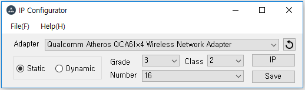

# IP Configurator
This program is a program to help you set your IP address.

# How to use
1. Select your Wi-Fi Adapter.
2. Choose dynamic or static.
3. Input your grade, class, and number.
4. Click sava button and enjoy your internet!

# Screenshot

